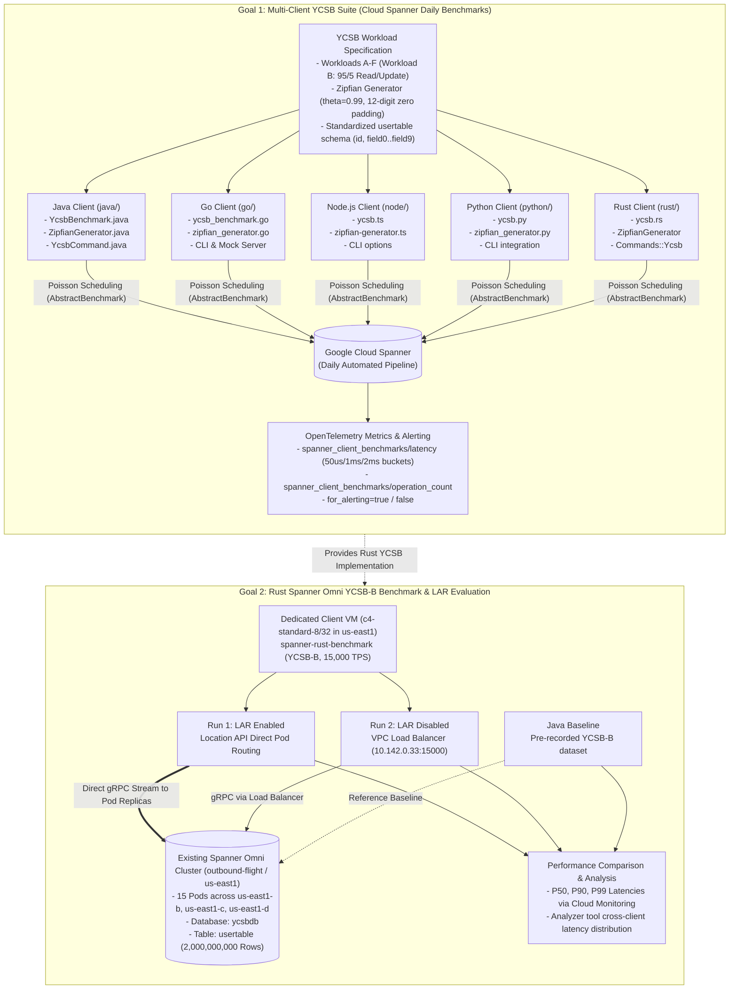

# Implementation Plan: Spanner Multi-Client YCSB Suite & Rust Spanner Omni Benchmark

This plan defines the end-to-end architecture, workload implementation, and execution methodology to achieve two primary objectives:

1. **Goal 1: Implement YCSB for ALL Client Libraries (Cloud Spanner Daily Benchmarks)**  
   Implement a standardized YCSB benchmark suite across all 5 client implementations in this repository (**Java, Go, Node.js, Python, Rust**) supporting both Google Cloud Spanner and Spanner Omni. This enables running YCSB workloads (A through F) as part of daily automated benchmarks on Cloud Spanner with unified Poisson scheduling, OpenTelemetry metrics, and cross-language comparability.
2. **Goal 2: Specifically Benchmark the Spanner Rust Client with Spanner Omni**  
   Execute the reference **YCSB Workload B** against the running **Spanner Omni cluster** in project `outbound-flight` (`us-east1`), leveraging the pre-populated 2-billion-record `ycsbdb` database. Benchmark the Rust client with **Location-Aware Routing (LAR) enabled vs. disabled**, evaluate direct pod routing performance, and compare latency/throughput percentiles directly against the Java client baseline.

---



---

# Phase 1: Implement YCSB Suite for ALL Clients (Cloud Spanner Daily Benchmarks)

### 1.1 Standard YCSB Workload & Key Generation Specification

All 5 client languages must implement identical workload mechanics and key distributions to guarantee 100% parity across languages:

| Workload | Read Ratio | Write / Update Ratio | Insert / Scan Ratio | Description |
| :--- | :--- | :--- | :--- | :--- |
| **Workload A** | 50% | 50% (Update) | 0% | Heavy update mix |
| **Workload B** | **95%** | **5% (Update)** | 0% | **Read-mostly mix (Primary evaluation workload)** |
| **Workload C** | 100% | 0% | 0% | 100% Read-only |
| **Workload D** | 95% | 0% | 5% (Insert) | Read latest / new records |
| **Workload E** | 0% | 5% (Insert/Update) | 95% (Scan: 1-100 rows) | Short range scans |
| **Workload F** | 50% (Read) | 50% (Read-Modify-Write) | 0% | Read-modify-write transactional update |

#### Key Generation & Table Schema
* **Key Format**: `user{:0width$}` (e.g. `user000000000000` for `width=12`, default record count = `2,000,000,000`).
* **Key Distribution**:
  * **Scrambled Zipfian Generator**: Parameter $\theta = 0.99$ over `[0, record_count - 1]` with FNV-1a 64-bit scrambling.
  * **Zipfian Generator**: Parameter $\theta = 0.99$ over `[0, record_count - 1]`.
  * **Uniform Generator**: Uniform random integer over `[0, record_count - 1]`.
* **Table Schema**:
  ```sql
  CREATE TABLE usertable (
      id STRING(MAX) NOT NULL,
      field0 BYTES(MAX),
      field1 BYTES(MAX),
      field2 BYTES(MAX),
      field3 BYTES(MAX),
      field4 BYTES(MAX),
      field5 BYTES(MAX),
      field6 BYTES(MAX),
      field7 BYTES(MAX),
      field8 BYTES(MAX),
      field9 BYTES(MAX)
  ) PRIMARY KEY (id);
  ```
* **Operations**:
  * **Point Read**: Single-use read snapshot executing `SELECT * FROM usertable WHERE id = @id` (or reading all 10 columns by primary key).
  * **Update**: Read-write transaction or mutation updating `field0` (or random field) with 100 bytes of random payload.

---

### 1.2 Language Implementations

#### 1. ☕ Java (`java/`)
- **Zipfian Generator**: [ZipfianGenerator.java](file:///Users/loite/IdeaProjects/spanner-client-benchmarks/java/src/main/java/com/google/cloud/spanner/benchmark/ZipfianGenerator.java) with $\theta = 0.99$ and standard zero-padded key formatting.
- **Benchmark Implementation**: [YcsbBenchmark.java](file:///Users/loite/IdeaProjects/spanner-client-benchmarks/java/src/main/java/com/google/cloud/spanner/benchmark/YcsbBenchmark.java) extending `AbstractBenchmark`.
- **CLI Subcommand**: [YcsbCommand.java](file:///Users/loite/IdeaProjects/spanner-client-benchmarks/java/src/main/java/com/google/cloud/spanner/benchmark/YcsbCommand.java) supporting `--workload` (`a`, `b`, `c`, `d`, `e`, `f`), `--record-count`, `--zero-padding`, `--host`, `--channels`.
- **Omni & Cloud Spanner**: Respects `--host` endpoint override and custom channel count.
- **Unit Tests**: Mock server test in `YcsbBenchmarkTest.java`.

#### 2. 🐹 Go (`go/`)
- **Zipfian Generator**: `zipfian_generator.go` wrapping `rand.Zipf` with precalculated $\theta = 0.99$ and string padding.
- **Benchmark Implementation**: `ycsb_benchmark.go` implementing `RunBenchmark` loop.
- **CLI Subcommand**: `ycsb` subcommand in `main.go` with `--workload`, `--record-count`, `--zero-padding`, `--host`, `--channels`.
- **Omni & Cloud Spanner**: `createSpannerClient` configured with plaintext/insecure gRPC dial options when `--host` is specified.
- **Unit Tests**: Test case in `main_test.go` with mock Spanner server.

#### 3. 📦 Node.js (`node/`)
- **Zipfian Generator**: `src/benchmarks/zipfian-generator.ts` using fast numerical approximation for Zipfian sampling.
- **Benchmark Implementation**: `src/benchmarks/ycsb.ts` extending `AbstractBenchmark`.
- **CLI Subcommand**: `ycsb` subcommand in `src/index.ts` with `--workload`, `--record-count`, `--zero-padding`, `--host`, `--channels`.
- **Omni & Cloud Spanner**: Supports custom endpoint via `apiEndpoint` and insecure gRPC credentials.
- **Unit Tests**: Integration test in `dist/src/test/ycsb.test.js`.

#### 4. 🐍 Python (`python/`)
- **Zipfian Generator**: `src/benchmarks/zipfian_generator.py` using `numpy.random.zipf` or fast inverse CDF approximation.
- **Benchmark Implementation**: `src/benchmarks/ycsb.py` extending `AbstractBenchmark`.
- **CLI Subcommand**: `ycsb` subcommand in `src/main.py`.
- **Omni & Cloud Spanner**: Custom `client_options` with custom endpoint and channel settings.
- **Unit Tests**: `test_ycsb.py` unit test.

#### 5. 🦀 Rust (`rust/`)
- **Zipfian Generator**: `rust/src/ycsb.rs` using `rand_distr::Zipf` ($\theta = 0.99$).
- **Benchmark Implementation**: `rust/src/ycsb.rs` implementing point read snapshots and read-write updates.
- **CLI Subcommand**: `Commands::Ycsb` in `rust/src/lib.rs` supporting `--workload` (`a`, `b`, `c`, `d`, `e`, `f`), `--record-count`, `--zero-padding`, `--host`, `--channels`, `--location-routing`.
- **Omni & Cloud Spanner**:
  - Automatically configures plaintext HTTP/2 channel builder when `--host` is provided.
  - Supports Location-Aware Routing (`GOOGLE_SPANNER_EXPERIMENTAL_LOCATION_API` / `--location-routing`).
- **Unit Tests**: Mock server unit test in `rust/tests/` and in-crate tests.

---

### 1.3 Framework Runner & Deployment Updates
- **`run_benchmark.sh`**:
  - Accept `BENCHMARK_TYPE=ycsb`
  - Accept `YCSB_WORKLOAD=b` (or `a`, `c`, `d`, `e`, `f`)
  - Accept `RECORD_COUNT=2000000000`
  - Accept `ZERO_PADDING=12`
  - Accept `HOST=...`
  - Forward these arguments to the Docker entrypoint in all client containers.
- **ChatOps Bot Integration**:
  - Update `.github/scripts/parse_chatops.py` to add `ycsb` to `SUPPORTED_BENCHMARKS` and accept `ycsb_workload` option.
  - Update `.github/workflows/gemini-chatops.yml`.

---

# Phase 2: Rust Spanner Omni YCSB-B Benchmark & LAR Evaluation

### 2.1 Target Environment (Pre-Populated Omni Cluster)

| Attribute | Configuration | Description |
| :--- | :--- | :--- |
| **GCP Project** | `outbound-flight` | Shared Spanner Omni test environment |
| **GKE Cluster** | `irahul-regional-cluster` (or `rolling-restart`) | Multi-zone regional cluster in `us-east1` |
| **Omni Nodes** | 30x `c4-standard-4` across `us-east1-b`, `us-east1-c`, `us-east1-d` | High-performance compute with hyperdisk-balanced SSDs |
| **Omni Pods** | 15 pods (`spanner-a-0..4`, `spanner-b-0..4`, `spanner-c-0..4`) | 3 zones, 5 replicas per zone |
| **Internal Endpoint** | `http://10.142.0.33:15000` (VPC) / `http://spanner.spanner-ns:15000` (K8s DNS) | Plaintext HTTP/2 gRPC endpoint |
| **Database** | `projects/default/instances/default/databases/ycsbdb` | Pre-populated YCSB database |
| **Table & Scale** | `usertable` with **2,000,000,000 records** (`user000000000000` .. `user000199999999`) | 12-digit zero-padded primary key, 10 fields |

---

### 2.2 Location-Aware Routing (LAR) Mechanics in Rust Client

When Location-Aware Routing is enabled:
1. **Location API Probing**: The Rust Spanner client queries the Spanner Omni Location API to discover tablet replica pod endpoints and availability zone mappings.
2. **KeyRangeCache & Direct Tablet Routing**: The client hashes/matches the sampled YCSB key (e.g. `user000123456789`) against cached split boundaries and routes point reads directly to the specific pod hosting the tablet replica in the local zone, avoiding load balancer proxy latency.
3. **ConnectionCache**: Maintains persistent HTTP/2 gRPC channels to individual Omni pod instances.
4. **Fallback & LAR Toggle**: If LAR is disabled via `GOOGLE_SPANNER_EXPERIMENTAL_LOCATION_API=false` (or `--location-routing=false`), the client dispatches all gRPC calls through the front-end load balancer (`10.142.0.33:15000`).

---

### 2.3 Detailed Rust Implementation Snippets

#### `rust/Cargo.toml`
Add `rand_distr` for Zipfian sampling:
```toml
[dependencies]
google-cloud-spanner = { git = "https://github.com/googleapis/google-cloud-rust", package = "google-cloud-spanner" }
google-cloud-auth = { git = "https://github.com/googleapis/google-cloud-rust", package = "google-cloud-auth" }

tokio = { version = "1.52", features = ["full"] }
prost-types = "0.14"
tonic = "0.14"
clap = { version = "4.6", features = ["derive"] }
rand = "0.10"
rand_distr = "0.6"
anyhow = "1.0"
opentelemetry = { version = "0.31", features = ["metrics"] }
opentelemetry_sdk = { version = "0.31", features = ["rt-tokio", "testing"] }
opentelemetry-otlp = { version = "0.31", features = ["metrics"] }
serde_json = "1.0"
time = { version = "0.3", features = ["formatting", "parsing"] }
futures = "0.3"
rustls = { version = "0.23", features = ["aws_lc_rs"] }
opentelemetry_gcloud_monitoring_exporter = "0.23.0"
sysinfo = "0.39"
uuid = { version = "1.11", features = ["v4"] }
tracing = "0.1"
tracing-subscriber = { version = "0.3", features = ["env-filter", "fmt"] }
spanner-grpc-mock = { git = "https://github.com/googleapis/google-cloud-rust", package = "spanner-grpc-mock" }
```

#### `rust/src/ycsb.rs`
```rust
use anyhow::Context;
use google_cloud_spanner::client::DatabaseClient;
use google_cloud_spanner::mutation::insert_or_update;
use google_cloud_spanner::statement::Statement;
use rand::Rng;
use rand::distr::Distribution;
use rand_distr::Zipf;

#[derive(Clone, Copy, Debug, clap::ValueEnum, PartialEq, Eq)]
pub enum YcsbWorkload {
    A, // 50% read, 50% update
    B, // 95% read, 5% update
    C, // 100% read
    D, // 95% read, 5% insert
    F, // 50% read, 50% read-modify-write
}

pub struct ZipfianGenerator {
    zipf: Zipf<f64>,
    record_count: u64,
    zero_padding: usize,
}

impl ZipfianGenerator {
    pub fn new(record_count: u64, zero_padding: usize) -> anyhow::Result<Self> {
        let zipf = Zipf::new(record_count as f64, 0.99)
            .map_err(|e| anyhow::anyhow!("Failed to create Zipfian generator: {:?}", e))?;
        Ok(Self {
            zipf,
            record_count,
            zero_padding,
        })
    }

    pub fn next_key<R: Rng>(&self, rng: &mut R) -> String {
        let sample = self.zipf.sample(rng) as u64;
        let id = sample % self.record_count;
        format!("user{:0width$}", id, width = self.zero_padding)
    }
}

pub async fn execute_ycsb_point_read(
    db_client: &DatabaseClient,
    table: &str,
    key: &str,
) -> anyhow::Result<()> {
    let sql = format!("SELECT * FROM {} WHERE id = @id", table);
    let statement = Statement::new(sql).bind("id", key);
    let mut reader = db_client
        .single_use()
        .execute_query(statement)
        .await
        .context("execute_query failed")?;
    while let Some(_row) = reader.next().await? {}
    Ok(())
}

pub async fn execute_ycsb_update(
    db_client: &DatabaseClient,
    table: &str,
    key: &str,
    new_value: &[u8],
) -> anyhow::Result<()> {
    let key_clone = key.to_string();
    let val_clone = new_value.to_vec();
    let table_clone = table.to_string();
    db_client
        .read_write_transaction(|mut tx| {
            let key = key_clone.clone();
            let val = val_clone.clone();
            let table = table_clone.clone();
            async move {
                let m = insert_or_update(&table)
                    .bind("id", key)
                    .bind("field0", val)
                    .build();
                tx.buffer_write(vec![m]);
                Ok(())
            }
        })
        .await
        .context("YCSB update transaction failed")?;
    Ok(())
}
```

#### `rust/src/lib.rs` Subcommand Definition
```rust
#[derive(Subcommand, Debug, Clone)]
pub enum Commands {
    // ... existing commands ...
    Ycsb {
        #[arg(long, value_enum, default_value_t = ycsb::YcsbWorkload::B)]
        workload: ycsb::YcsbWorkload,
        #[arg(long, default_value_t = 15000.0)]
        tps: f64,
        #[arg(long, default_value_t = 2000000000)]
        record_count: u64,
        #[arg(long, default_value_t = 12)]
        zero_padding: usize,
        #[arg(long, default_value_t = true)]
        location_routing: bool,
    },
}
```

---

### 2.4 Execution Steps: Rust Benchmark against Omni

We will execute the benchmark runs on a dedicated GCE VM (`c4-standard-8` or `c4-standard-32`) in `us-east1` within the `default` VPC:

#### Step 1: Connectivity Smoke Test Against Live Omni Cluster
Run a quick 30-second verification query against the live Omni cluster:
```bash
gcloud compute ssh --zone=us-east1-b <test-vm> --project=outbound-flight -- \
  curl -s http://10.142.0.33:15012/healthz
```

#### Step 2: Run Rust Benchmark with LAR ENABLED (Default for Omni)
```bash
./run_benchmark.sh rust \
  PROJECT_ID=default \
  INSTANCE_ID=default \
  DATABASE_ID=ycsbdb \
  TABLE_NAME=usertable \
  HOST=http://10.142.0.33:15000 \
  BENCHMARK_TYPE=ycsb \
  YCSB_WORKLOAD=b \
  RECORD_COUNT=2000000000 \
  ZERO_PADDING=12 \
  DURATION=15m \
  TPS=15000
```

#### Step 3: Run Rust Benchmark with LAR DISABLED
```bash
GOOGLE_SPANNER_EXPERIMENTAL_LOCATION_API=false ./run_benchmark.sh rust \
  PROJECT_ID=default \
  INSTANCE_ID=default \
  DATABASE_ID=ycsbdb \
  TABLE_NAME=usertable \
  HOST=http://10.142.0.33:15000 \
  BENCHMARK_TYPE=ycsb \
  YCSB_WORKLOAD=b \
  RECORD_COUNT=2000000000 \
  ZERO_PADDING=12 \
  DURATION=15m \
  TPS=15000
```

---

### 2.5 Verification & Cross-Client Baseline Comparison

1. **Pre-Completion Unit Testing & Lint Checklist**:
   - Run formatters, linters, and unit tests for all modified directories:
     - Java: `mvn fmt:format && mvn test`
     - Go: `gofmt -s -w . && go test -v ./...`
     - Node: `npm run format && npm run build && node --test dist/src/test/**/*.test.js`
     - Python: `ruff format . && ruff check --fix . && python3 -m unittest discover -s tests`
     - Rust: `cargo fmt && npx @taplo/cli fmt && cargo test`
2. **Metrics Verification via Google Cloud Monitoring**:
   - Confirm telemetry under `workload.googleapis.com/spanner_client_benchmarks/latency` and `operation_count`.
   - Verify sustained throughput of **15,000+ QPS per client** (or **45,000 QPS aggregate**).
   - Extract **P50, P90, P99 latency percentiles**.
3. **Comparison Against Java Baseline**:
   - Use the [analyzer/](file:///Users/loite/IdeaProjects/spanner-client-benchmarks/analyzer) tool to compare Rust (LAR on vs. off) with the Java YCSB-B baseline dataset run by your co-worker on the exact same 2B-row Omni cluster in `outbound-flight`.

